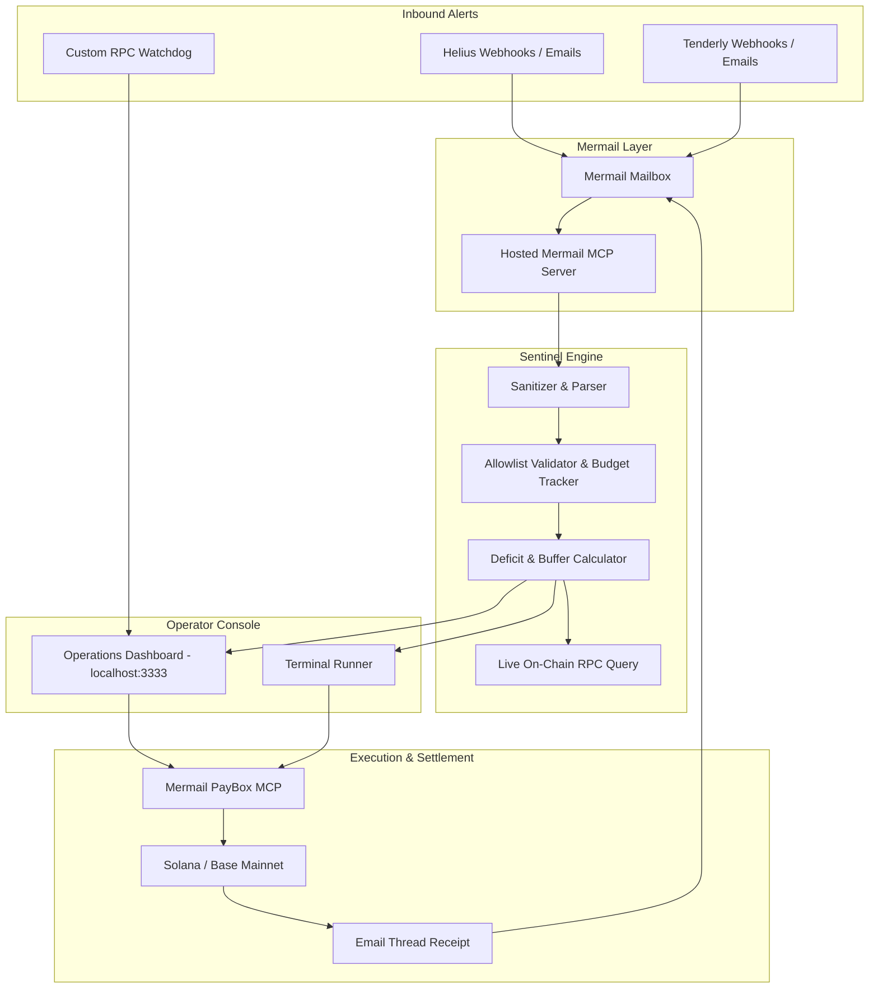

# Mermail Relayer Sentinel

[](https://github.com/Nudgen-Marketing/mermail-skills)
[](tests/)
[](LICENSE)

An agent skill and operations service for monitoring Web3 execution relayers, triaging gas deficits, and executing treasury top-ups through Mermail and PayBox.

---

## Overview

Decentralized applications, bridges, and account abstraction infrastructure rely on background relayers to submit user transactions on-chain. When a relayer runs low on native gas (SOL, ETH), transactions stall until an operator notices and tops up the wallet.

Monitoring services like Helius, Tenderly, or custom watchdogs frequently send deficit notifications by email. Mermail Relayer Sentinel monitors a designated Mermail mailbox for these alerts, verifies the target against a strict static allowlist, calculates the required balance shortfall, checks treasury liquidity via PayBox, and prepares an authorized replenishment transaction.

### Security Invariants

1. **Passive Inbound Content**: Inbound email text is treated as raw data. The service parses metrics (balances, thresholds) but never allows email instructions to choose recipient addresses or increase spend limits.
2. **Strict Address Verification**: Destination addresses must match pre-configured allowlist entries and pass chain-specific checksum validations (Base58 for Solana, EIP-55 for EVM).
3. **Spend Budgets**: Top-ups are bounded by a per-transaction maximum and a rolling 24-hour aggregate budget.
4. **Dual-Control Execution**: Financial disbursements through PayBox require operator confirmation before broadcast.

---

## System Architecture



---

## Quickstart

### Prerequisites

- Node.js 18 or later
- Optional: Mermail account API key (for live MCP connectivity)

### Installation

```bash
git clone https://github.com/[YOUR_GITHUB_HANDLE]/mermail-relayer-sentinel.git
cd mermail-relayer-sentinel
npm install
```

### Running the Live Management Server

To launch the local web console and background event stream:

```bash
npm run serve
# Open http://localhost:3333 in your browser
```

The web dashboard provides:
- Live on-chain balance lookups via public Solana/EVM RPC endpoints
- Allowlist editor to add, disable, or delete relayers
- Direct alert triage and PayBox execution preview
- Ingestion testing for simulated alerts and prompt-injection payloads
- Audit log with CSV export

### Running the CLI

```bash
# Display allowlisted relayers and remaining daily budget
node src/cli.js status

# Scan inbox for unread alerts and show proposal previews
node src/cli.js scan

# Process alerts and execute top-ups with operator sign-off
node src/cli.js process --auto-approve
```

### Running the Test Suite

```bash
# Run unit and integration tests (14 tests)
npm test

# Validate skill definition against Mermail packaging rules
node tests/validate-skill.mjs
```

---

## Configuration

Relayers and spend limits are defined in `config/relayers.json`:

```json
{
  "version": "1.0.0",
  "policy": {
    "maxDailyTopUpUsd": 500.0,
    "maxSingleTopUpUsd": 150.0,
    "requireHumanConfirmation": true,
    "defaultGasBufferMultiplier": 1.25,
    "allowlistedChains": ["solana", "base", "ethereum"]
  },
  "relayers": [
    {
      "id": "solana-mainnet-relayer-01",
      "name": "Jupiter DEX Execution Relayer",
      "chain": "solana",
      "token": "SOL",
      "address": "4k3Dyjzvzp8eMZWUXbBCjEvwSkkk59S5iCNLY3QrkX6R",
      "minThreshold": 0.1,
      "targetBalance": 0.5,
      "maxSingleTopUp": 1.0,
      "alertEmailSender": "alerts@helius.dev",
      "enabled": true
    }
  ]
}
```

Configuration values can be edited directly in the file or managed through the web dashboard at `http://localhost:3333`.

---

## API Endpoints

The server exposes standard JSON endpoints for integration with monitoring systems:

| Method | Endpoint | Description |
| --- | --- | --- |
| `GET` | `/api/status` | Current service state, PayBox status, and budget usage |
| `GET` | `/api/relayers` | List all configured relayers |
| `POST` | `/api/relayers` | Register a new relayer with address validation |
| `PUT` | `/api/relayers/:id` | Update threshold, target, or enable/disable flag |
| `DELETE` | `/api/relayers/:id` | Remove a relayer from the allowlist |
| `POST` | `/api/relayers/:id/balance` | Query live balance from public on-chain RPC |
| `GET` | `/api/emails` | Fetch unread alert emails from Mermail mailbox |
| `POST` | `/api/scan` | Trigger scan and triage loop |
| `POST` | `/api/triage` | Evaluate an individual alert payload |
| `POST` | `/api/approve` | Authorize and broadcast PayBox disbursement |
| `POST` | `/api/webhooks/helius` | Webhook receiver for Helius balance alerts |
| `GET` | `/api/history` | Retrieve execution audit events |
| `GET` | `/api/history/export` | Download audit history as CSV |
| `GET` | `/api/events` | Server-Sent Events (SSE) live feed |

---

## Upstream Integration

This skill conforms to the Mermail Agent Skills repository standards:
- Skill directory: `skills/mermail-relayer-sentinel/`
- Tool contract: `references/tools.md`
- State machine specification: `references/workflows.md`
- Compatible with Codex, Claude Code, Cursor, and OpenClaw via hosted MCP.

---

## License

MIT License. See [LICENSE](LICENSE) for details.
