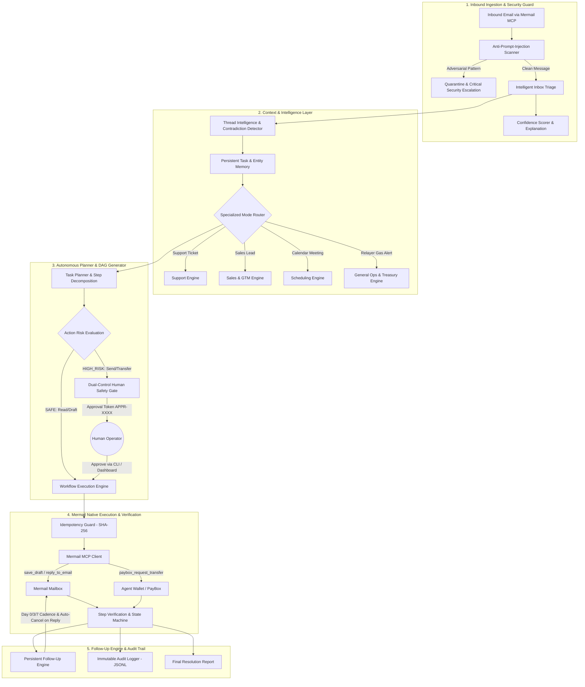

# Mermail Autonomous Operations Agent

[](https://github.com/Nudgen-Marketing/mermail-skills)
[-success)](tests/)
[](tests/validate-skill.mjs)
[](LICENSE)

An enterprise-grade autonomous operations agent powered by **Mermail** and the **Model Context Protocol (MCP)**. It transforms an AI agent's inbox and Agent Wallet into an end-to-end operational workforce that triages incoming communications, extracts structured intent, decomposes goals into verified DAG steps, executes actions with dual-control human authorization, manages persistent multi-day follow-up cadences, detects thread-level contradictions, and maintains an immutable audit trail.

```
EMAIL / MESSAGE ➔ INTENT UNDERSTANDING ➔ TASK PLANNING ➔ ACTION EXECUTION ➔ VERIFICATION ➔ FOLLOW-UP ➔ FINAL REPORT
```

---

## Why Mermail?

Traditional AI email bots are shallow single-prompt wrappers: they receive an email, generate a generic hallucinated response, and fire it off without verification.

The **Mermail Autonomous Operations Agent** demonstrates why Mermail is the foundational layer for true agentic systems:
1. **Inbox as an Agent Nervous System**: Mermail gives agents an authenticated, addressable email identity (`ops@dapp.mermail.app`) capable of receiving machine alerts, client inquiries, and human communications.
2. **Deterministic Multi-Step Planning**: Instead of immediate execution, the agent evaluates goals, identifies safe vs high-impact steps, and plans ordered DAG workflows.
3. **Dual-Control Human Safety**: High-impact actions (financial disbursements via PayBox, external commitments, sensitive emails) generate cryptographic approval tokens (`APPR-XXXX`) requiring human sign-off before broadcast.
4. **Persistent Multi-Day Follow-Up**: Persistent cadences (Day 0 ➔ Day 3 ➔ Day 7) that automatically cancel when counterparty replies are detected.
5. **Agent Wallet & PayBox Native**: Direct multi-chain treasury inspection, token swaps, and gas replenishment on Solana and EVM chains.

---

## 4 Specialized Operational Modes

All 4 operational modes share the same unified workflow state machine, persistent memory, safety gate, and follow-up engine:

| Mode | Trigger Types | Automated Actions | Human Safety Gate |
| :--- | :--- | :--- | :--- |
| **`SCHEDULING`** | Meeting requests, calendar sync, reschedule proposals | Availability constraint parsing, timezone normalization, candidate slots | Operator approves meeting confirmation email |
| **`SALES_GTM`** | Inbound leads, pricing queries, partnership proposals | ICP lead qualification score, value proposition draft, Day 3/7 cadences | Operator approves outbound sales draft |
| **`SUPPORT`** | Bug reports, webhook failures, error code inquiries | Ticket classification, SLA tracking, contextual troubleshooting draft | Operator reviews customer-facing response |
| **`GENERAL_OPS`** | Web3 low-gas alerts, relayer deficits, treasury rebalance | Allowlist address verification, PayBox liquidity check, swap/top-up proposal | Operator signs on-chain PayBox transaction |

---

## System Architecture



---

## 24 Core Features Breakdown

1. **Intelligent Inbox Triage** (`src/triage.js`): Ingests messages, categorizes into 4 modes, calculates urgency (`CRITICAL` to `LOW`) and priority (`P0` to `P3`), and extracts actionable entities and deadlines.
2. **Autonomous Task Planner** (`src/planner.js`): Converts goals into DAG execution steps, tags `SAFE` vs `HIGH_RISK`, and sets verification criteria.
3. **Smart Email Composition** (`src/composer.js`): Generates high-empathy, non-robotic, thread-aware responses with explicit calls-to-action.
4. **Human-in-the-Loop Safety** (`src/safety.js`): Segregates safe read/draft actions from high-impact external actions; issues cryptographic `APPR-XXXX` tokens with impact previews.
5. **Persistent Follow-Up Engine** (`src/followup.js`): Multi-day cadence (Day 0 ➔ Day 3 ➔ Day 7); auto-cancels the moment an inbound reply is detected.
6. **Conversation Memory** (`src/memory.js`): Persistent structured memory (`data/memory.json`) tracking contact profiles, preferences, and task states with zero secrets.
7. **Thread-Aware Intelligence** (`src/threads.js`): Reconstructs thread chronology, tracks historical commitments, and detects logical contradictions.
8. **Smart Escalation System** (`src/escalation.js`): Standardized 4-part Executive Briefs (*What Happened*, *Why Escalated*, *What Was Done*, *Decision Required*).
9. **Workflow State Machine** (`src/workflow-engine.js`): Deterministic 11-step FSM (`RECEIVED` ➔ `CLASSIFIED` ➔ `PLANNED` ➔ `WAITING_APPROVAL` ➔ `EXECUTING` ➔ `VERIFYING` ➔ `WAITING_FOR_REPLY` ➔ `COMPLETED` / `FAILED` ➔ `RETRYING` ➔ `ESCALATED`).
10. **Failure Recovery & Self-Healing** (`src/workflow-engine.js`): Error taxonomy (`TRANSIENT` vs `PERMANENT`), exponential backoff with jitter, and checkpoint resumption.
11. **Idempotency & Replay Protection** (`src/idempotency.js`): Deterministic SHA-256 keys preventing duplicate email dispatches or redundant blockchain transfers.
12. **Immutable Audit Trail** (`src/audit.js`): Append-only JSONL log (`data/audit_log.jsonl`) recording every action, tool, actor, and outcome.
13. **Security Layer** (`src/security.js`): Anti-prompt injection defense, RFC 5322 email regex, Base58/EVM address checksums, and regex secret scrubbing.
14. **Confidence Scoring & Rationale** (`src/confidence.js`): Quantified confidence score (0-100%) paired with concise decision explanations.
15. **Official Mermail-Native Tools** (`src/mermail-client.js`): 100% adherence to official schema: `list_mailboxes`, `list_emails`, `get_email`, `save_draft`, `reply_to_email`, `send_email`, `paybox_*`.
16. **4 Specialized Modes** (`src/modes/`): Dedicated engines for `SUPPORT`, `SALES_GTM`, `SCHEDULING`, and `GENERAL_OPS`.
17. **x402 / Payment Capability** (`src/x402.js`): Recognizes HTTP 402 paywall requirements, prepares dual-control quotes, and isolates simulation from devnet.
18. **Developer-Friendly CLI** (`bin/cli.js`): Complete CLI (`doctor`, `inbox`, `triage`, `plan`, `run`, `task`, `approve`, `workflows`, `audit`, `demo`).
19. **Lightweight Dashboard** (`src/server.js`, `public/index.html`): Real-time SSE streaming console on `http://localhost:3333`.
20. **Deterministic 60s Demo Mode** (`demo/run-demo.mjs`): Zero-config, self-contained walkthrough demonstrating the full lifecycle.
21. **Structured Observability** (`src/logger.js`): Leveled logging (`DEBUG`, `INFO`, `WARN`, `ERROR`, `SECURITY`, `AUDIT`) with correlation IDs and credential scrubbing.
22. **Comprehensive Test Suite** (`tests/`): 97 unit and integration tests across 42 test suites passing with 100% success rate.
23. **Competition Differentiation**: Solves authentic operations problems (contradiction detection, dual-control safety, multi-day cadences, treasury settlement, x402 payments).
24. **Polished Documentation**: Complete architectural, security, workflow, and judge evaluation guides in `docs/`.

---

## Quickstart (Zero Configuration)

The project includes deterministic mock infrastructure and local test fixtures, allowing anyone to run, inspect, and verify the entire system immediately without API keys or testnet tokens.

### 1. Installation

```bash
git clone https://github.com/[YOUR_GITHUB_HANDLE]/mermail-operations-agent.git
cd mermail-operations-agent
npm install
```

### 2. Run the 60-Second Judge Demo

```bash
npm run demo
```

You will see the agent autonomously ingest an email, triage intent, reconstruct thread commitments, generate a 4-step DAG, pause at the human safety gate, receive operator authorization, execute Mermail MCP calls, register a follow-up, auto-cancel when a reply arrives, neutralize an adversarial prompt injection attack, and write immutable audit records.

### 3. Run the Automated Test Suite

```bash
# Run all 97 unit & integration tests across 42 suites
npm test

# Run the official Mermail Skill Validator (100% compliant)
npm run test:skill

# Run both in sequence
npm run validate
```

---

## Developer CLI Reference

The CLI supports both human-readable console output and programmatic `--json` formatting for CI/CD or agent wrappers:

```bash
# Verify environment, Node version, and MCP connectivity
node bin/cli.js doctor
node bin/cli.js doctor --json

# View current messages in the Mermail inbox
node bin/cli.js inbox

# Run intelligent triage on an email
node bin/cli.js triage email_sched_01
node bin/cli.js triage email_sales_01
node bin/cli.js triage email_alert_hel_01

# Test simulated inbound email scenarios with built-in presets
node bin/cli.js test-email --preset sales
node bin/cli.js test-email --preset support
node bin/cli.js test-email --preset scheduling
node bin/cli.js test-email --preset x402
node bin/cli.js test-email --preset gas_alert
node bin/cli.js test-email --preset injection

# Generate autonomous DAG execution plan
node bin/cli.js plan

# Execute workflow up to approval boundary
node bin/cli.js run

# Authorize pending high-risk action via token
node bin/cli.js approve <APPROVAL_TOKEN>

# Reject pending action and abort
node bin/cli.js reject <APPROVAL_TOKEN> "Reason"

# Inspect active follow-up schedules or advance time for simulation
node bin/cli.js followups
node bin/cli.js followups --advance-days 3

# Inspect immutable audit trail with filtering
node bin/cli.js audit
node bin/cli.js audit --limit 10 --status SUCCESS --actor AGENT:AUTONOMOUS
node bin/cli.js audit --json
```

---

## Web Management Console

Launch the live dashboard on `http://localhost:3333`:

```bash
npm run serve
```

The web console provides:
- **Triage & Inbox Stream**: Real-time incoming email analysis and confidence scores.
- **Task Planner & FSM Visualizer**: Interactive DAG step viewer and state machine tracker.
- **Dual-Control Approvals Center**: 1-click Approve / Reject with preview.
- **Follow-Up Queue**: Multi-day cadence monitor with reply cancellation status.
- **Immutable Audit Feed**: Live SSE activity log.

---

## Configuration & Environments

Copy `.env.example` to `.env` to configure live Mermail credentials:

```bash
cp .env.example .env
```

| Variable | Default | Description |
| :--- | :--- | :--- |
| `ENVIRONMENT` | `mock` | Set to `live` for hosted Mermail MCP, or `mock` for local sandbox. |
| `MERMAIL_API_KEY` | *(empty)* | Official Mermail API Key from [console.mermail.app](https://console.mermail.app). |
| `MERMAIL_MAILBOX_ID` | `mbx_ops_sentinel_01` | Default agent mailbox ID. |
| `DAILY_MAX_USD_CAP` | `500.0` | Maximum rolling 24h spend cap for treasury operations. |
| `LOG_LEVEL` | `INFO` | Logging threshold (`DEBUG`, `INFO`, `AUDIT`, `WARN`, `ERROR`). |

---

## Upstream Skill Compliance

This repository includes official skill packages conforming strictly to `Nudgen-Marketing/mermail-skills`:
- `skills/mermail-operations-agent/SKILL.md`: Under 500 lines, YAML frontmatter, official Mermail tools only.
- `skills/mermail-relayer-sentinel/SKILL.md`: Upstream-validated Web3 gas and treasury operations sentinel.

Both skills pass the official upstream test validator:
```bash
node tests/validate-skill.mjs
```

---

## License

MIT License. Developed for the [Superteam Earn Mermail Agent Skill Bounty](https://superteam.fun/earn/listing/build-and-demo-a-mermail-agent-skill).
