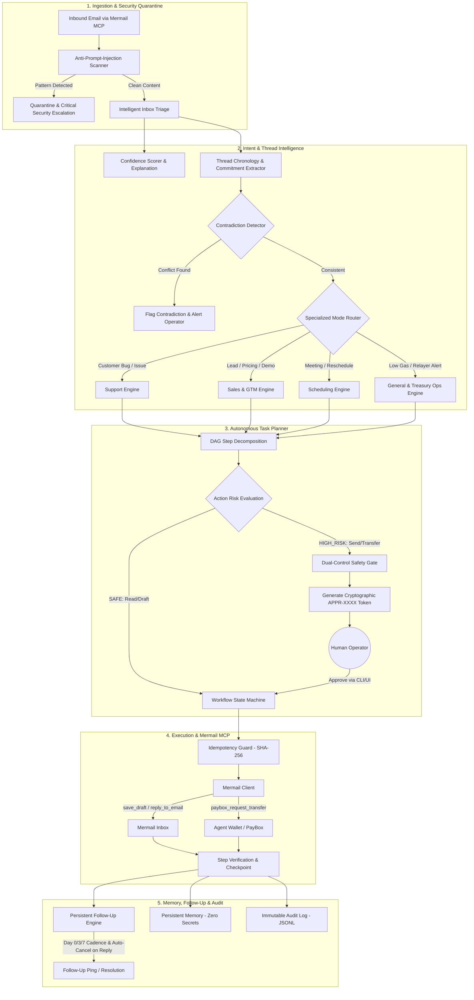

# Mermail Autonomous Operations Agent: Architecture Specification

## Overview

The **Mermail Autonomous Operations Agent** is an enterprise-grade agent system built around the official Mermail platform and Streamable HTTP Model Context Protocol (MCP). It bridges untrusted incoming communication channels with verified task planning, deterministic finite state machines, multi-chain Web3 treasury operations, and dual-control human authorization.

```
EMAIL / MESSAGE ➔ INTENT UNDERSTANDING ➔ TASK PLANNING ➔ ACTION EXECUTION ➔ VERIFICATION ➔ FOLLOW-UP ➔ FINAL REPORT
```

---

## High-Level Architecture Diagram



---

## 11-Step Finite State Machine

Every task is governed by an explicit finite state machine persisted in `data/memory.json`:

1. **`RECEIVED`**: Inbound email discovered in Mermail mailbox via `list_emails`.
2. **`CLASSIFIED`**: Triaged into one of the 4 modes (`SUPPORT`, `SALES_GTM`, `SCHEDULING`, `GENERAL_OPS`) with urgency and priority.
3. **`PLANNED`**: Decomposed into an ordered directed acyclic graph (DAG) of atomic steps.
4. **`WAITING_APPROVAL`**: Suspended before high-impact operations pending dual-control authorization.
5. **`EXECUTING`**: Invoking tools sequentially with exponential backoff for transient failures.
6. **`VERIFYING`**: Confirming outputs against step-level verification criteria.
7. **`WAITING_FOR_REPLY`**: Suspended awaiting counterparty response with active follow-up cadence.
8. **`FOLLOW_UP_REQUIRED`**: Triggered when follow-up timer expires without reply.
9. **`COMPLETED`**: Terminal success state; summary reported to operator.
10. **`FAILED`**: Step failure after exhaustion of safe retry limits.
11. **`ESCALATED`**: Halted for human intervention with structured 4-part Executive Brief.

---

## Modular Component Breakdown

| Module | File | Responsibility |
| :--- | :--- | :--- |
| **Orchestrator** | `src/operations-agent.js` | Coordinates triage, planning, execution, and Mermail tool calls. |
| **Triage Engine** | `src/triage.js` | Categorizes intent, urgency, deadlines, entities, and required actions. |
| **Confidence Scorer** | `src/confidence.js` | Quantifies confidence (0-100%) and generates concise non-fluff rationales. |
| **Task Planner** | `src/planner.js` | Deconstructs goals into DAG steps, tags risk levels, and assigns tools. |
| **Thread Intelligence** | `src/threads.js` | Reconstructs chronology, extracts commitments, and detects contradictions. |
| **Safety Engine** | `src/safety.js` | Enforces dual-control approval tokens (`APPR-XXXX`), previews, and prompt defense. |
| **Email Composer** | `src/composer.js` | Generates non-robotic, context-aware email responses with clear CTAs. |
| **Follow-Up Engine** | `src/followup.js` | Manages Day 0/3/7 follow-up cadences and auto-cancels on inbound reply. |
| **Memory Engine** | `src/memory.js` | Persists task states, contact preferences, and entity caches on disk. |
| **Idempotency Guard**| `src/idempotency.js` | Deterministic SHA-256 keys preventing duplicate email sends or transfers. |
| **Audit Trail** | `src/audit.js` | Immutable, append-only JSONL log of every agent action and tool call. |
| **Specialized Modes** | `src/modes/` | Mode-specific policies for Support, Sales/GTM, Scheduling, and Web3 General Ops. |
| **x402 Engine** | `src/x402.js` | Recognizes HTTP 402 paywalls and prepares safe dual-control payments. |
| **Developer CLI** | `bin/cli.js` | Full command-line interface (`doctor`, `triage`, `plan`, `run`, `approve`, `demo`). |
| **Web Server & UI** | `src/server.js` | Real-time SSE streaming, REST API, and interactive operator dashboard. |
