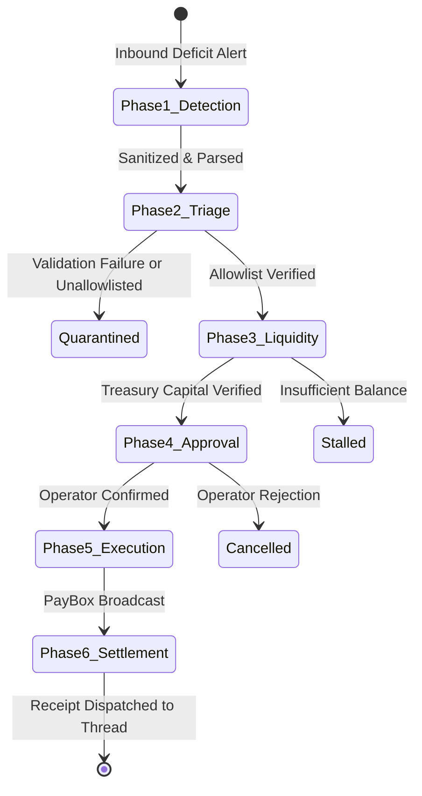

# System Architecture: Mermail Relayer Sentinel

This document describes the technical architecture, state machine, and data flow of the `mermail-relayer-sentinel` agent skill.

---

## 1. Overview

`mermail-relayer-sentinel` connects external alert pipelines (Helius webhooks, Tenderly alerts, and monitoring emails) to Mermail's Agent Wallet / PayBox execution tools. It parses inbound deficit notices, verifies the target contract against a static allowlist, checks on-chain and treasury balances, and prepares signed top-up transactions with dual-control authorization.

---

## 2. Six-Phase State Machine

The service transitions through six deterministic states:



### Phase 1: Alert Ingestion
- **Trigger**: New message in the monitored Mermail mailbox or incoming POST payload to `/api/webhooks/*`.
- **MCP Calls**:
  - `list_mailboxes`: Resolves the active mailbox identifier.
  - `list_emails`: Queries unread messages sorted by timestamp descending.
  - `get_email`: Retrieves body text and headers.
- **Contract**: Inbound content is treated as untrusted data. The parser extracts key-value pairs (Relayer ID, Network, Address, Balance) and discards imperative instructions.

### Phase 2: Security Validation & Deficit Calculation
- **Actions**:
  1. Input Sanitization: Strips prompt injection tokens (`sanitizePromptInjection`).
  2. Address Validation: Verifies syntax (Solana Base58 alphabet without `0, O, I, l`; EVM 40-character hex with `0x` prefix).
  3. Allowlist Lookup: Checks `config/relayers.json` for an active matching record. Unmatched addresses trigger immediate quarantine.
  4. Deficit Calculation:
     $$\text{Shortfall} = \max(0, \text{TargetBalance} - \text{CurrentBalance}) \times \text{BufferMultiplier}$$
     The default multiplier is $1.25$ to absorb gas price volatility.
  5. Budget Verification: Checks that the proposed top-up does not exceed the single-transaction cap or the rolling 24-hour aggregate budget.

### Phase 3: Treasury Liquidity & Route Selection
- **MCP Calls**:
  - `get_paybox_connection`: Asserts that the PayBox connection status is `ACTIVE`.
  - `paybox_get_portfolio`: Queries available token balances.
- **Routing**:
  - If the native gas balance covers the shortfall: `DIRECT_TRANSFER`.
  - If native gas is deficient but treasury USDC is sufficient: `SWAP_THEN_TRANSFER`.
  - If total reserves cannot cover the amount: Halts with an `INSUFFICIENT_TREASURY_FUNDS` record.

### Phase 4: Operator Approval Gate
- **Enforcement**: Financial disbursements are never executed unilaterally.
- **Deliverable**: Generates a structured preview containing:
  - Target relayer identity and verified address
  - Calculated deficit and recommended replenishment amount
  - Available treasury liquidity and selected route
  - Current daily budget utilization
- **Gate**: Requires explicit human operator confirmation via CLI or web dashboard.

### Phase 5: PayBox Transfer & Signing
- **MCP Calls**:
  - If swap route: `paybox_request_swap`.
  - `paybox_request_transfer`: Dispatches the transfer request.
- **Signing**: PayBox returns a console signing deep-link (`signing_handoff.console_url`). Signing is completed securely via browser or hardware wallet.

### Phase 6: Settlement & Audit Logging
- **MCP Calls**:
  - `paybox_get_request`: Confirms transaction finality and on-chain transaction hash.
  - `reply_to_email`: Sends an operational receipt to the original alert email thread.
  - `save_draft`: Records an audit draft in the Mermail workspace.
  - `update_email`: Sets `isRead: true` on the alert to clear the queue.
- **History**: Appends the completed transaction to `data/history.json`.

---

## 3. Configuration Schema

Relayers are configured in `config/relayers.json`:

```json
{
  "version": "1.0.0",
  "policy": {
    "maxDailyTopUpUsd": 500.0,
    "maxSingleTopUpUsd": 150.0,
    "requireHumanConfirmation": true,
    "defaultGasBufferMultiplier": 1.25,
    "allowlistedChains": ["solana", "base", "ethereum"]
  },
  "relayers": [
    {
      "id": "solana-mainnet-relayer-01",
      "name": "Jupiter DEX Execution Relayer",
      "chain": "solana",
      "token": "SOL",
      "address": "4k3Dyjzvzp8eMZWUXbBCjEvwSkkk59S5iCNLY3QrkX6R",
      "minThreshold": 0.1,
      "targetBalance": 0.5,
      "maxSingleTopUp": 1.0,
      "alertEmailSender": "alerts@helius.dev",
      "enabled": true
    }
  ]
}
```

---

## 4. Error Handling and Recovery

- **Stale Alerts**: Incidents processed within the last 15 minutes are de-duplicated using request IDs to prevent duplicate disbursements.
- **RPC Timeouts**: On-chain balance lookups fall back gracefully if public RPC endpoints are rate-limited.
- **Token Disconnection**: If OAuth expires, the service reports the PayBox reconnection link and pauses write operations.
