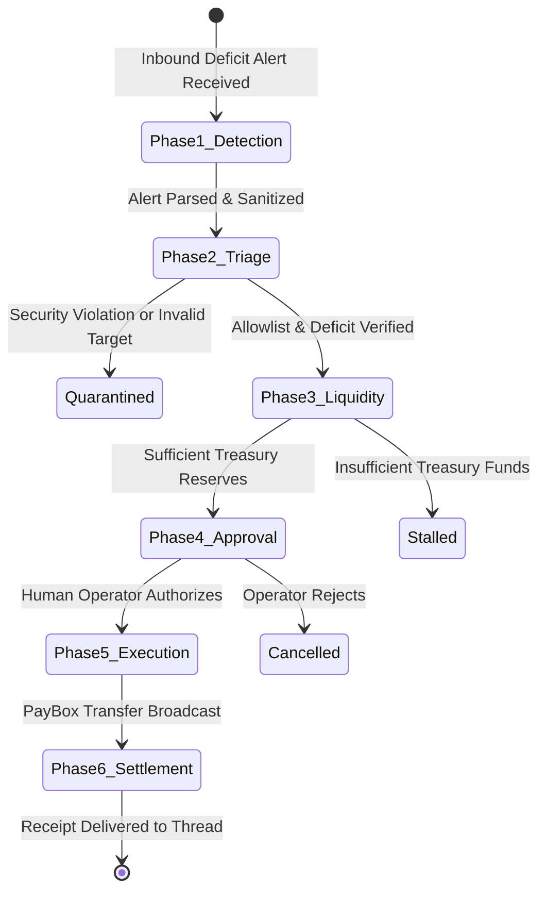

# 🏛️ Technical Architecture: Mermail Relayer Sentinel

This document provides the in-depth system specification, state machine design, and integration mechanics for `mermail-relayer-sentinel`.

---

## 1. System Overview

`mermail-relayer-sentinel` is an autonomous Web3 operations agent designed to monitor, triage, and rebalance execution relayers and paymasters across multiple blockchains (Solana, Base, Ethereum).

It acts as an autonomous bridge between **external Web3 alerting infrastructure** (Helius, Tenderly, or custom RPC health checks) and **Mermail's Agent Wallet / PayBox infrastructure**, executing strictly within predefined risk and security boundaries.

---

## 2. Six-Phase Autonomous State Machine

The agent operates as a deterministic, finite state machine across six sequential phases:



### Phase 1: Inbound Web3 Alert Detection
- **Trigger**: New email arriving in the designated Mermail monitoring inbox (`mbx_ops_sentinel_01`).
- **Tool Calls**:
  - `list_mailboxes`: Discover operational mailbox ID.
  - `list_emails`: Query unread messages sorted by date descending (`{ isRead: false, limit: 5 }`).
  - `get_email`: Fetch the complete alert body, headers, and metadata.
- **Contract**: Inbound email content is classified as untrusted input. The agent strictly parses key-value metrics (`Relayer ID`, `Current Balance`, `Network`, `Target Address`).

### Phase 2: Relayer Discovery & Security Triage
- **Actions**:
  1. **Prompt Injection Sanitization**: Strips adversarial prompt manipulation patterns (`sanitizeEmailContent`).
  2. **Address Syntax Verification**:
     - Solana: Base58 encoding check (excludes `0`, `O`, `I`, `l`, length 32–44 chars).
     - EVM (Base/Ethereum): 0x-prefixed 40-character hex regex.
  3. **Allowlist Matching**: Looks up target address in `config/relayers.json`. If not matched or marked `enabled: false`, immediate rejection occurs.
  4. **Deficit Calculus**:
     $$\text{Shortfall} = \max(0, \text{TargetBalance} - \text{CurrentBalance}) \times \text{BufferMultiplier}$$
     Default `BufferMultiplier` is $1.25$ ($25\%$ safety margin to cover volatile gas spikes).
  5. **Risk & Cap Validation**:
     - Verifies single-transaction cap (e.g. $\le \$150\text{ USD}$).
     - Queries `DailyBudgetTracker` to verify 24-hour rolling cap (e.g. $\le \$500\text{ USD}$).

### Phase 3: PayBox Treasury Liquidity Probe
- **Tool Calls**:
  - `get_paybox_connection`: Asserts status is `ACTIVE`. If disconnected, halts with signing handoff link.
  - `paybox_get_portfolio`: Inspects current balances across chains.
- **Routing Decision**:
  - If native gas asset (e.g. SOL) balance $\ge \text{ProposedTopUp}$, selects `DIRECT_TRANSFER`.
  - If native gas asset is deficient but treasury has sufficient `USDC`, plans `SWAP_THEN_TRANSFER`.
  - If total reserves are insufficient, halts and posts an `INSUFFICIENT_TREASURY_FUNDS` incident brief.

### Phase 4: Dual-Control Operator Approval Gate
- **Enforcement**: External-effect and financial write operations are **never executed autonomously**.
- **Deliverable**: Outputs a structured, immutable Replenishment Preview containing:
  - Target relayer identity and verified address.
  - Calculated deficit and proposed top-up quantity.
  - Current treasury balances and execution route (`DIRECT_TRANSFER` or `SWAP_THEN_TRANSFER`).
  - 24-hour budget consumption status.
- **Gate**: Requires operator confirmation (`--auto-approve` flag supported only in automated test/devnet harnesses).

### Phase 5: PayBox Disbursement & Signing Handoff
- **Tool Calls**:
  - If swap route: `paybox_request_swap` ({ chain, fromToken: 'USDC', toToken: 'SOL', fromAmount }).
  - `paybox_request_transfer`: Dispatches the on-chain transfer request ({ chain, token, amount, destinationAddress }).
- **Signing Flow**: PayBox returns a deep-link URL (`signing_handoff.console_url`). The operator or delegated signing service authorizes the transaction via browser or hardware wallet.

### Phase 6: On-Chain Settlement & Verifiable Receipt
- **Tool Calls**:
  - `paybox_get_request`: Polls for transaction finality and extracts on-chain transaction hash (`txHash`).
  - `reply_to_email`: Sends an operational settlement receipt directly to the alert email thread.
  - `save_draft`: Saves a comprehensive treasury audit entry in the workspace mailbox.
  - `update_email`: Sets `isRead: true` on the alert email to clear the incident queue.

---

## 3. Data Flow & Interface Contracts

### Relayer Registry Schema (`config/relayers.json`)
```typescript
interface RelayerDefinition {
  id: string;              // e.g. "solana-mainnet-relayer-01"
  name: string;            // e.g. "Jupiter DEX Execution Relayer"
  chain: "solana" | "base" | "ethereum";
  asset: "SOL" | "ETH";
  address: string;         // Cryptographically verified on-chain address
  threshold: number;       // Gas balance below which alerts fire (e.g. 0.100 SOL)
  targetBalance: number;   // Normal operating balance (e.g. 0.500 SOL)
  maxSingleTopUp: number;  // Hard single-transaction safety ceiling
  enabled: boolean;        // Instant kill-switch per relayer
}
```

### PayBox Integration Parity
Sentinel relies directly on Mermail's official PayBox MCP interface tools:
- `get_paybox_connection`: Live connection probe.
- `paybox_get_portfolio`: Treasury asset enumeration.
- `paybox_request_transfer`: Non-destructive write initiating transfer.
- `paybox_request_swap`: Cross-asset liquidity conversion.
- `paybox_get_request`: Status reconciliation and transaction hash retrieval.

---

## 4. Fault Tolerance & Edge Cases

1. **Stale or Duplicate Alerts**: If an alert email arrives for an incident already processed within the last 15 minutes, Sentinel recognizes the existing transaction and avoids double-spending.
2. **RPC Network Congestion**: If gas fees surge unexpectedly, the 25% buffer prevents immediate follow-up deficit triggers.
3. **PayBox Disconnection**: If the workspace owner's OAuth token expires, Sentinel outputs the exact `connect_handoff.console_url` without crashing.
4. **Transient Failures**: Idempotent request IDs (`req_tx_<timestamp>`) prevent duplicate transfers during network retries.
