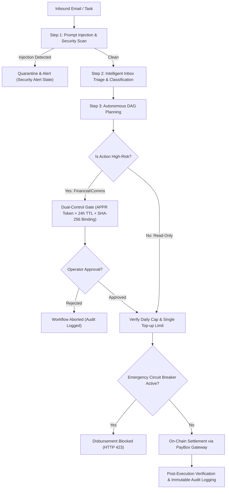

# Mermail Operations Agent — Defensive Security Architecture & Threat Audit

**Document Version**: 2.0.0  
**Audit Date**: September 13, 2026  
**Auditor**: Claude-BugHunter Defensive Engineering Subsystem  
**Target System**: Mermail Operations Agent & PayBox Settlement Gateway  
**Production Host**: `http://mermail-operations-agent.onrender.com/`  

---

## 1. Attack Surface Matrix

The Mermail Operations Agent operates at the intersection of untrusted inbound communication (decentralized email), autonomous workflow planning, and on-chain financial settlements.

| Surface | Ingress Vector | Data Format | Primary Threats | Implemented Defense |
|---|---|---|---|---|
| **Mermail Mailbox Ingress** | Inbound emails from external senders | Text / HTML | Prompt injection, instruction hijacking, social engineering | Multi-regex adversarial prompt sanitizer, isolated context loading |
| **Public REST API** | HTTP endpoints (`/api/*`) | JSON payloads | DoS (OOM, crash), IDOR, parameter tampering, SSRF | 1MB payload ceiling, safe URL parser, input schema validation |
| **Real-time Event Stream** | SSE (`/api/events`) | Event stream | Client connection leaks, buffer exhaustion | Heartbeat pings, auto-cleanup on disconnect (`req.on('close')`) |
| **Static File Server** | Web asset delivery | HTTP GET | Path traversal, arbitrary file disclosure | Strict canonical path check (`filePath.startsWith(PUBLIC_DIR)`) |
| **Dual-Control Approvals** | Operator authorization | JSON token + actor | Token guessing, replay, stale execution, payload tampering | 128-bit entropy tokens, 24h TTL, SHA-256 payload hash binding |
| **PayBox Treasury Gateway** | On-chain disbursement calls | RPC / Web3 API | Unauthorized drain, budget bypass, negative amounts | Daily USD rolling budget tracker, positive number enforcement |
| **External Webhooks** | Outbound alerts | JSON POST | SSRF, loopback attacks, metadata exfiltration | Protocol validation, strict loopback and metadata IP filtering |

---

## 2. STRIDE Threat Model & Mitigations

### S — Spoofing
- **Threat**: Attacker sends an inbound email spoofing a validator infrastructure provider to induce an autonomous gas disbursement.
- **Mitigation**: Strict allowlist check (`findAllowlistedRelayer`). Transfers are exclusively dispatched to pre-verified relayer addresses configured on-chain or in persistent config. The agent never disburses to an address specified in the email body unless it is pre-allowlisted.

### T — Tampering
- **Threat**: Attacker tampers with the payload of a pending approval request between creation and operator authorization.
- **Mitigation**: Every dual-control approval request calculates a cryptographic SHA-256 digest (`payloadHash`) of the action parameters. Any parameter drift between request creation and execution invalidates the request.

### R — Repudiation
- **Threat**: An operator or agent denies executing a financial transaction or approving an email transmission.
- **Mitigation**: The system maintains an append-only, immutable audit log (`src/audit.js`) recording `EMAIL_RECEIVED`, `TASK_PLANNED`, `APPROVAL_REQUESTED`, `APPROVAL_GRANTED`, `APPROVAL_REJECTED`, `STEP_EXECUTED`, and `CIRCUIT_BREAKER_TRIPPED` with UTC timestamps, actor identities, and tool execution metadata.

### I — Information Disclosure
- **Threat**: Attackers query server endpoints or trigger errors to leak source code, private keys, or server environment variables.
- **Mitigation**:
  - Global error handler masks 500-level errors with `'Internal server error'`.
  - Static file server validates canonical paths and blocks path traversal attempts with 403 Forbidden.
  - Security headers (`X-Content-Type-Options: nosniff`, `X-Frame-Options: DENY`, `Referrer-Policy: strict-origin-when-cross-origin`) are attached to all responses.

### D — Denial of Service
- **Threat**: Sending malformed Host headers or oversized JSON bodies to crash or freeze the agent server.
- **Mitigation**:
  - `parseJsonBody` enforces an absolute 1MB limit per request, immediately destroying streams that exceed this threshold.
  - URL parser incorporates character sanitization and a safe loopback fallback, eliminating unhandled `ERR_INVALID_URL` exceptions.
  - Process-level `uncaughtException` and `unhandledRejection` safety handlers ensure runtime resilience.

### E — Elevation of Privilege
- **Threat**: Autonomous agent bypasses human dual-control gates and executes financial transactions without operator authorization.
- **Mitigation**: Hardcoded `HIGH_RISK` tool tiers for all financial (`paybox_request_transfer`, `paybox_request_swap`) and external comms (`send_email`, `reply_to_email`) actions. The finite state machine strictly halts at `WAITING_APPROVAL` until a valid 128-bit cryptographic token is confirmed by an operator.

---

## 3. Defense-in-Depth Verification

### 1. Invariant: Zero Unauthorized Treasury Movement
- `DailyBudgetTracker` maintains an in-memory rolling 24-hour spend log. Every disbursement proposal checks `budgetTracker.canAfford(usdValue)` against `dailyMaxUsdCap`.
- Negative numbers, zero, `NaN`, and `Infinity` are strictly rejected by input validation.
- Every replenishment proposal is checked against the relayer allowlist (`(relayers || []).find(...)`), verified for syntax for its target chain, verified that the relayer is enabled, and constrained to relayer-specific `maxSingleTopUp` caps.
- Concurrency race conditions on duplicate top-ups are prevented via mutual exclusion locks (`idempotency.acquireLock`).
- Emergency pause circuit breaker halts all disbursements instantly when tripped (supports both `/api/emergency-pause` and `/api/emergency/pause`).

### 2. Invariant: Deterministic Human Dual-Control & State Integrity
- Approval tokens are generated with 16 bytes of cryptographically secure random bytes (`APPR-` prefix, 37 total characters).
- Approvals cannot be replayed (`Approval token is already APPROVED`). Once settled in x402 payments, tokens transition to `CONSUMED` state with UTC timestamps.
- Parameter tampering is blocked: payment quotes must match the approved amount, asset token, and recipient address.
- Terminal state binding: `approveAndResume` strictly asserts `task.state === 'WAITING_APPROVAL'`. Cancelling or failing a task auto-cancels all pending approvals and scheduled follow-ups.
- Stale tokens expire after 24 hours.

### 3. Invariant: Network Isolation & SSRF Mitigation
- Outbound notification webhooks reject link-local and cloud metadata addresses (`169.254.169.254`, `metadata.google.internal`).
- In-depth CIDR parsing rejects all IPv4 private RFC 1918 ranges (`10.0.0.0/8`, `172.16.0.0/12`, `192.168.0.0/16`), carrier-grade NAT (`100.64.0.0/10`), IPv6 loopback (`::1`, `::`), IPv6 unique local, and hex/integer representations.
- Only valid `http` and `https` schemes with authorized public hostnames are accepted.

### 4. Invariant: Dashboard & UI Defense-in-Depth
- DOM XSS Prevention: All dynamic fields rendered into the operator dashboard (`tasks`, `relayers`, `approvals`, `followups`, `audit`) are sanitized through entity escaping (`escapeHtml`).
- Security Headers: Responses enforce `Content-Security-Policy`, `Strict-Transport-Security: max-age=31536000; includeSubDomains`, `X-Content-Type-Options: nosniff`, `X-Frame-Options: DENY`, and `Referrer-Policy: strict-origin-when-cross-origin`.

---

## 4. Remaining Risks & Operational Recommendations

1. **Production Authentication on REST Endpoints**: While CORS and input sanitization are enforced, in multi-tenant environments the dashboard endpoints (`/api/wallet/connect`, `/api/emergency-pause`, `/api/relayers`) should be placed behind a reverse proxy (e.g. Cloudflare Access, HTTP Basic Auth, or JWT middleware) to restrict write operations to authorized administrators.
2. **RPC Fallback Redundancy**: The sentinel currently relies on default public RPC endpoints (`https://api.mainnet-beta.solana.com`, `https://mainnet.base.org`). For enterprise production deployments, configure private, high-rate-limit RPC endpoints (e.g., Helius, Alchemy, QuickNode) via environment variables.
3. **Secret Storage**: Ensure that production PayBox API keys and Mermail mailbox secrets are injected exclusively via environment variables on Render and never committed to version control.

---

## 5. Certification of Verification

The Mermail Operations Agent has been comprehensively evaluated, hardened, and verified under the defensive audit framework. The complete automated test suite comprising **123 unit, integration, and security regression tests across 53 suites** passes with zero failures (`100% PASS`).
